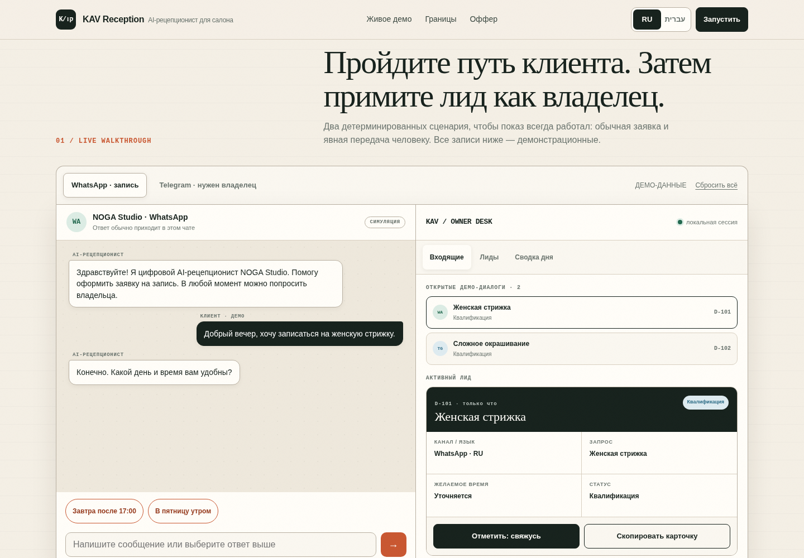

# KAV AI Reception Demo

Interactive RU/HE prototype of a narrow AI receptionist for Israeli local businesses.

**Live demo:** https://arinbus.github.io/kav-ai-receptionist-demo/



## What the prototype demonstrates

- disclosed AI assistance rather than pretending to be a human;
- WhatsApp-style appointment intake and Telegram-style human handoff;
- Russian and Hebrew UI with correct LTR/RTL direction;
- owner inbox, structured lead card, lead table, daily summary, takeover and CSV export;
- conservative boundaries: requested time is not a confirmed booking, unusual questions go to a person, and no medical advice is generated;
- business name and city can be personalized locally in the browser;
- a reusable clinic-safe preset can be opened through query parameters without sending data anywhere; it limits the scripted flow to administrative booking and staff handoff, with no diagnosis, symptom assessment, treatment advice, or automated triage.

Everything is deterministic and self-contained in `index.html`. The demo does **not** connect to WhatsApp, Telegram, calendars, external APIs, or real customer data.

### Clinic-safe direct demo

Use `profile=dental` with optional bounded `business`, `city`, and `lang=ru|he` parameters. The values stay inside the browser tab and are rendered as text, not sent to a server.

<https://arinbus.github.io/kav-ai-receptionist-demo/?profile=dental&business=Demo%20Clinic&city=Bat%20Yam&lang=ru>

The clinic preset demonstrates administrative new-booking intake and explicit staff handoff. It deliberately does not collect symptoms or medical history and never diagnoses, recommends treatment, or triages urgency.

## Pilot outline

A paid pilot is scoped around one approved process and one official business channel:

1. map questions, exceptions, RU/HE copy and human-handoff rules;
2. connect the channel supplied and approved by the business;
3. produce structured lead cards and owner notifications;
4. test acceptance conversations and keep a manual fallback.

Indicative draft range shown in the demo: **₪2,500–5,000** for a pilot and **₪600–2,000/month** for support, with the exact scope agreed before work begins. Provider and Meta/WhatsApp fees are not included.

[Request a tailored demo](https://github.com/Arinbus/kav-ai-receptionist-demo/issues/new?template=demo-request.yml) — please use only public business information and do not post customer or patient data.

## Запросить демонстрацию

Прототип показывает административную RU/HE-запись, карточку лида и явную передачу владельцу. Это симуляция без реальных аккаунтов и клиентских данных. [Запросить адресный показ](https://github.com/Arinbus/kav-ai-receptionist-demo/issues/new?template=demo-request.yml).

## בקשת הדגמה

הדמו מציג קליטת פנייה אדמיניסטרטיבית בעברית וברוסית, כרטיס ליד והעברה ברורה לאדם. זוהי סימולציה ללא חשבונות או נתוני לקוחות אמיתיים. [לבקש הדגמה מותאמת](https://github.com/Arinbus/kav-ai-receptionist-demo/issues/new?template=demo-request.yml).

## Run locally

```bash
python3 -m http.server 8765 --bind 127.0.0.1
# open http://127.0.0.1:8765/
```

Static verification:

```bash
python3 scripts/verify_demo.py
```

Browser smoke testing requires Playwright/Chromium:

```bash
node scripts/browser_smoke.js http://127.0.0.1:8765/
```

The recorded checks are in [`QA_REPORT.md`](QA_REPORT.md).

## License

MIT — see [`LICENSE`](LICENSE).
